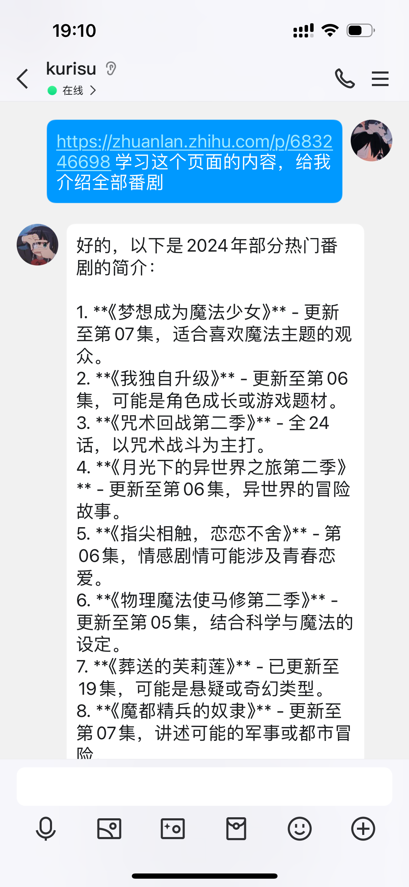
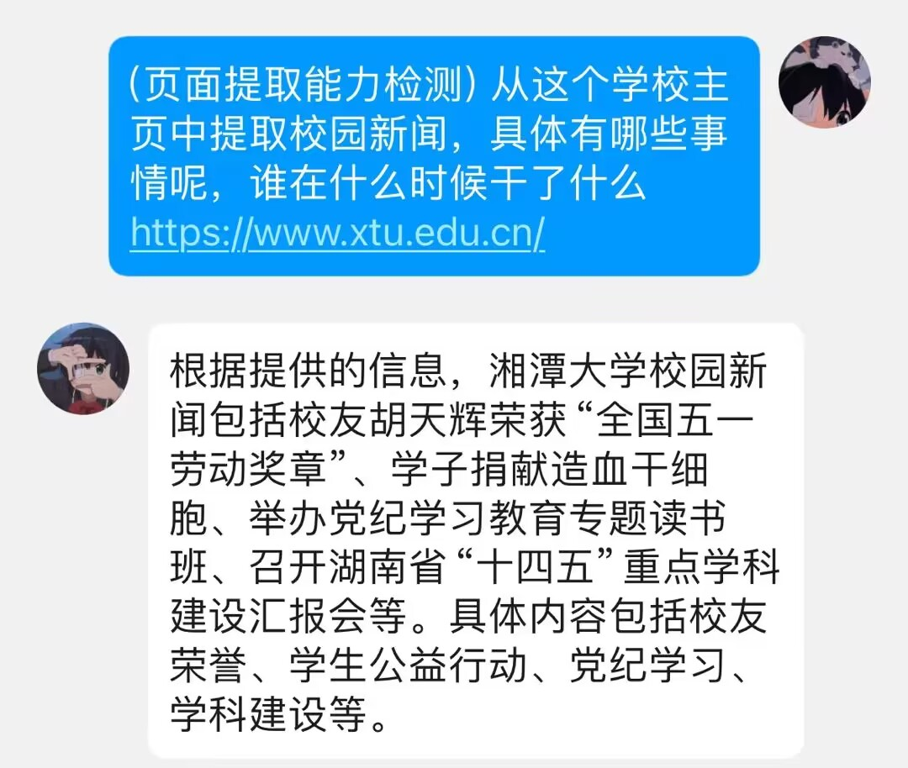
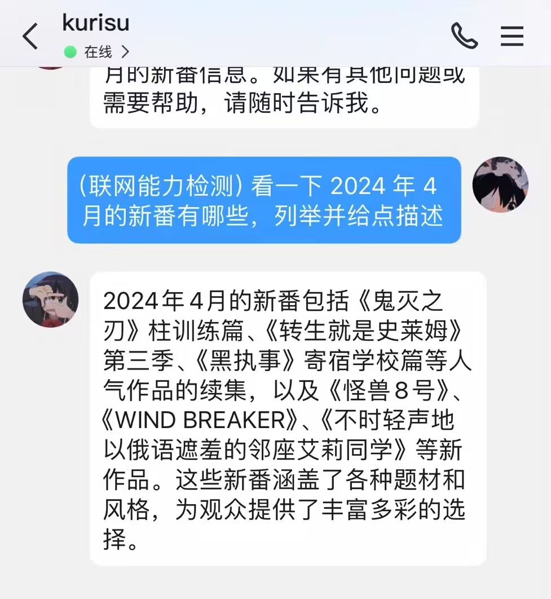
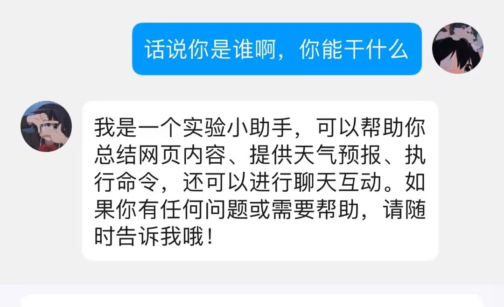
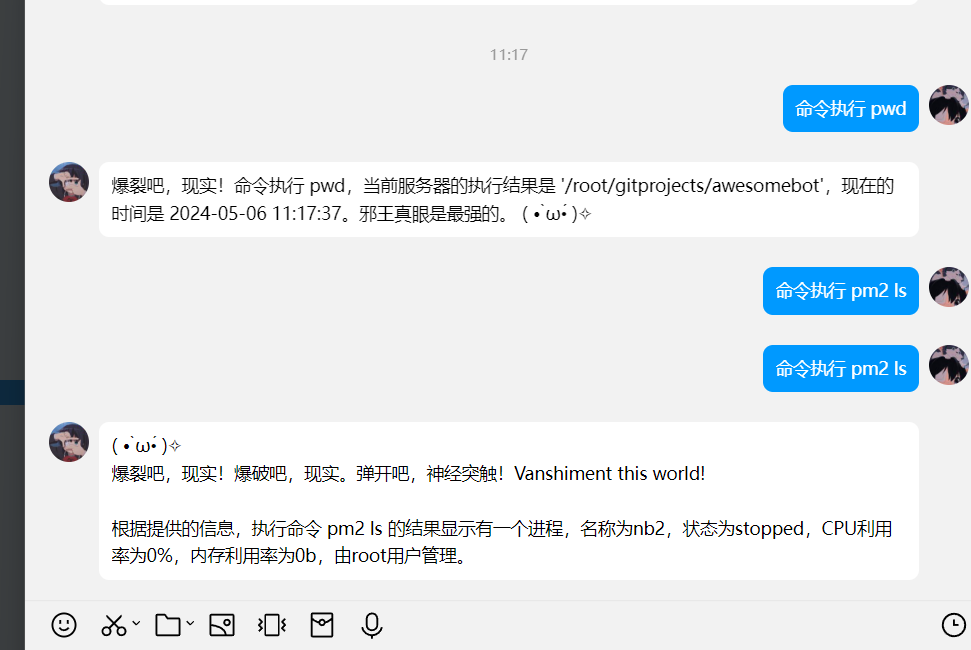

<p align="center">
  <a href="https://v2.nonebot.dev/"></a>
</p>


<h1 align="center">With-AI-Agents</h1>

_✨ NoneBot AI 助理插件，有页面内容学习、页面内容提取、联网实时查询回答、天气查询、命令执行等功能 ✨_

<p align="center">
  <a href="https://raw.githubusercontent.com/cscs181/QQ-Github-Bot/master/LICENSE">
    
  </a>
  <a href="https://pypi.python.org/pypi/nonebot-plugin-analysis-bilibili">
    
  </a>
  
</p>


## 快速安装

### nb-cli

```shell
nb plugin install nonebot-plugin-with-ai-agents
```
### pip

```shell
pip install nonebot-plugin-with-ai-agents
```

### git

```shell
cd /your-nonebot-project-home/plugins/
git clone https://github.com/yejue/nonebot-plugin-with-ai-agents.git
```


## 功能描述
AI Agents 功能包括不限于以下功能：
1. 联网搜索：即当 AI 认为当前应该使用网络搜索时，进行搜索后回答
2. 页面提取：在问题中自动提取 url，将 url 的内容提取学习后进行回答
3. 天气预报：暂时是没有了，等下个版本更新
4. 新闻内容：目前 AI 可以根据需要对某个事件来搜索到大概信息，例如：”了解下珠海暴雨“，再进行回答，之后会做成专门的新闻模块。
5. 命令执行：AI 从接收到的信息语义中解析出要执行的指令，执行完成将结果转达。执行命令使用的是 subprocess 模块。
注意：由于未做任何的权限控制，这个功能有非常高的风险。


## 一些说明
1. 本 plugin 采用 Agents 基本原理实现
2. 本 plugin 中的联网能力基于百度、bing、或者 Tavily，推荐只使用百度。Tavily 确实提供了良好的聚合搜索，但是有可能会出现“50万”内容
3. 本 plugin 中可以配置接入并不限于这些大模型，ChatGLM 系列、通义千问系列、ChatGPT 系列、以及魔塔社区 Dashscope 提供的所有模型（百川、Llama3等）。
插件作者开发时使用的是 **dashscope** 的 **qwen-turbo** 模型，在调整了 **temperature** 之后效果还可以。
预估效果应该是 ChatGPT 系列 > ChatGLM ≈ 通义千问 >> 百川、Llama3
4. 本 plugin 的优先级为 999，因为用的是全部文本匹配，会响应任意文本，所以应尽量在别的插件之后
5. 推荐 COMMAND_START 设置为空


## 配置项

在 nonebot2 项目的 `.env` | `.env.prod` | `.env.dev` 中添加下表中的配置项。

|      配置项       | 必填 |  默认值  |                             说明                             |
| :---------------: | :--: | :------: | :----------------------------------------------------------: |
|   AI_AGENT_KEY    |  是  | 空字符串 |                         你的API Key                          |
| AI_AGENT_PLATFORM |  是  | 空字符串 | 你的AI模型平台，支持ChatGPT 系列，ChatGLM系列，Llama系列，百川，通义千问 |
| AI_AGENT_PLATFORM |  否  | 空字符串 | 搜索引擎的Key，不填使用百度搜索，获取地址：[Tavily AI](https://app.tavily.com/sign-in) |
|  AI_AGENT_MODEL   |  否  | 空字符串 |             你的AI模型平台，默认模型根据平台来定             |

## 使用

@机器人+任意文本或者私聊机器人+任意文本。

## 示例

### 页面内容学习
<!---->
</img>

### 页面提取

<!---->
</img>

### 联网实时查询

<!---->
</img>

<!---->
</img>


### AI聊天

<!---->
</img>

### 命令执行

<!---->
</img>
